# Roadmap

The full 50-day path through the curriculum. Each box is a session — click to open the lesson. Colour marks the phase. Solid arrows are the day-to-day sequence; dotted arrows are cross-phase prereqs (a later session that builds on an earlier one outside the immediate week).

If you want the narrative version with rationale, see [Curriculum](curriculum.md) and [Why this curriculum](rationale.md). For the interactive explorable graph, see [Interactive Graph](kb/interactive-graph.html).

```mermaid
flowchart TD
  subgraph W01["Week 01 · Orientation & Foundations"]
    direction TB
    W01M1["Day 01 · Welcome & Context"]
    W01M2["Day 02 · Shell & Linux"]
    W01M1 --> W01M2
    W01M3["Day 03 · Git Workflow"]
    W01M2 --> W01M3
    W01M4["Day 04 · How Computers Run AI"]
    W01M3 --> W01M4
    W01M5["Day 05 · Consolidation"]
    W01M4 --> W01M5
  end
  subgraph W02["Week 02 · The GPU & Memory"]
    direction TB
    W02M1["Day 06 · What Happens When You Send a Prompt"]
    W02M2["Day 07 · Meet the GPU"]
    W02M1 --> W02M2
    W02M3["Day 08 · Memory Is the Bottleneck"]
    W02M2 --> W02M3
    W02M4["Day 09 · Compute-Bound vs Memory-Bound"]
    W02M3 --> W02M4
    W02M5["Day 10 · Consolidation"]
    W02M4 --> W02M5
  end
  subgraph W03["Week 03 · Attention & KV Cache"]
    direction TB
    W03M1["Day 11 · Prefill vs Decode"]
    W03M2["Day 12 · KV Cache"]
    W03M1 --> W03M2
    W03M3["Day 13 · FlashAttention"]
    W03M2 --> W03M3
    W03M4["Day 14 · Quantization"]
    W03M3 --> W03M4
    W03M5["Day 15 · Consolidation"]
    W03M4 --> W03M5
  end
  subgraph W04["Week 04 · Scaling & Stacks"]
    direction TB
    W04M1["Day 16 · Multi-GPU Parallelism"]
    W04M2["Day 17 · Pipeline Parallelism + MoE"]
    W04M1 --> W04M2
    W04M3["Day 18 · Speculative Decoding"]
    W04M2 --> W04M3
    W04M4["Day 19 · vLLM Introduction"]
    W04M3 --> W04M4
    W04M5["Day 20 · Consolidation"]
    W04M4 --> W04M5
  end
  subgraph W05["Week 05 · Metrics & Production"]
    direction TB
    W05M1["Day 21 · Latency vs Throughput"]
    W05M2["Day 22 · Production Deployment"]
    W05M1 --> W05M2
    W05M3["Day 23 · LLM Evaluation"]
    W05M2 --> W05M3
    W05M4["Day 24 · Inference Economics"]
    W05M3 --> W05M4
    W05M5["Day 25 · Consolidation + Phase 1 Problem Set"]
    W05M4 --> W05M5
  end
  subgraph W06["Week 06 · Prompt Engineering + AI Agents"]
    direction TB
    W06M1["Day 26 · Prompt Engineering"]
    W06M2["Day 27 · Agent Fundamentals"]
    W06M1 --> W06M2
    W06M3["Day 28 · Tools & Action Layer"]
    W06M2 --> W06M3
    W06M4["Day 29 · Governance"]
    W06M3 --> W06M4
    W06M5["Day 30 · Orchestration"]
    W06M4 --> W06M5
    W06M6["Day 31 · Consolidation + Phase 2 Agent Design"]
    W06M5 --> W06M6
  end
  subgraph W07["Week 07 · Bridge: Theory Meets Tooling"]
    direction TB
    W07M1["Day 32 · Agent Case Studies"]
    W07M2["Day 33 · Capsule Foundations"]
    W07M1 --> W07M2
    W07M3["Day 34 · Installation"]
    W07M2 --> W07M3
    W07M4["Day 35 · Environments"]
    W07M3 --> W07M4
    W07M5["Day 36 · Consolidation"]
    W07M4 --> W07M5
  end
  subgraph W08["Week 08 · Capsule: Connections & Operations"]
    direction TB
    W08M1["Day 37 · Connecting"]
    W08M2["Day 38 · Files & Storage"]
    W08M1 --> W08M2
    W08M3["Day 39 · Streaming"]
    W08M2 --> W08M3
    W08M4["Day 40 · Known Quirks"]
    W08M3 --> W08M4
    W08M5["Day 41 · Consolidation"]
    W08M4 --> W08M5
  end
  subgraph W09["Week 09 · Capsule: Benchmarking & Eval"]
    direction TB
    W09M1["Day 42 · Benchmarking"]
    W09M2["Day 43 · Model Evaluation"]
    W09M1 --> W09M2
    W09M3["Day 44 · Interactive Chat"]
    W09M2 --> W09M3
    W09M4["Day 45 · Scheduling & MCP"]
    W09M3 --> W09M4
    W09M5["Day 46 · Consolidation"]
    W09M4 --> W09M5
  end
  subgraph W10["Week 10 · Capstone Project"]
    direction TB
    W10M1["Day 47 · Kickoff & Planning"]
    W10M2["Day 48 · Execute"]
    W10M1 --> W10M2
    W10M3["Day 49 · Analyze & Recommend"]
    W10M2 --> W10M3
    W10M4["Day 50 · Present"]
    W10M3 --> W10M4
    W10M5["Day 51 · Close"]
    W10M4 --> W10M5
  end
  W01M5 --> W02M1
  W02M5 --> W03M1
  W03M5 --> W04M1
  W04M5 --> W05M1
  W05M5 --> W06M1
  W06M6 --> W07M1
  W07M5 --> W08M1
  W08M5 --> W09M1
  W09M5 --> W10M1
  %% cross-phase shortcuts
  W01M4 -.-> W02M1
  W02M4 -.-> W03M1
  W02M3 -.-> W03M3
  W02M3 -.-> W03M4
  W02M2 -.-> W04M1
  W03M1 -.-> W04M3
  W03M2 -.-> W04M4
  W05M1 -.-> W05M4
  W07M3 -.-> W08M1
  W08M1 -.-> W09M1
  W07M3 -.-> W09M1
  W05M3 -.-> W09M2
  W09M1 -.-> W09M3
  W09M1 -.-> W10M1
  W05M3 -.-> W10M1
  W09M2 -.-> W10M1

  classDef orientation fill:#1f2937,stroke:#7c8aa0,color:#e7e9ee;
  classDef inference fill:#0e2a32,stroke:#22d3ee,color:#e7f7fb;
  classDef prompting fill:#2a1e3d,stroke:#a78bfa,color:#efeaff;
  classDef agents fill:#3b2d10,stroke:#fbbf24,color:#fdf3d4;
  classDef capsule fill:#0f2f25,stroke:#34d399,color:#dff9ee;
  classDef capstone fill:#3a1320,stroke:#fb7185,color:#ffe2e8;
  class W01M1,W01M2,W01M3,W01M4,W01M5 orientation;
  class W02M1,W02M2,W02M3,W02M4,W02M5,W03M1,W03M2,W03M3,W03M4,W03M5,W04M1,W04M2,W04M3,W04M4,W04M5,W05M1,W05M2,W05M3,W05M4,W05M5 inference;
  class W06M1,W06M2,W06M3,W06M4,W06M5,W06M6 agents;
  class W08M1,W08M2,W08M3,W08M4,W08M5,W09M1,W09M2,W09M3,W09M4,W09M5 capsule;
  class W10M1,W10M2,W10M3,W10M4,W10M5 capstone;

  click W01M1 "../lessons/week-01/module-1/index/" "Welcome & Context"
  click W01M2 "../lessons/week-01/module-2/index/" "Shell & Linux"
  click W01M3 "../lessons/week-01/module-3/index/" "Git Workflow"
  click W01M4 "../lessons/week-01/module-4/index/" "How Computers Run AI"
  click W01M5 "../lessons/week-01/module-5/index/" "Consolidation"
  click W02M1 "../lessons/week-02/module-1/index/" "What Happens When You Send a Prompt"
  click W02M2 "../lessons/week-02/module-2/index/" "Meet the GPU"
  click W02M3 "../lessons/week-02/module-3/index/" "Memory Is the Bottleneck"
  click W02M4 "../lessons/week-02/module-4/index/" "Compute-Bound vs Memory-Bound"
  click W02M5 "../lessons/week-02/module-5/index/" "Consolidation"
  click W03M1 "../lessons/week-03/module-1/index/" "Prefill vs Decode"
  click W03M2 "../lessons/week-03/module-2/index/" "KV Cache"
  click W03M3 "../lessons/week-03/module-3/index/" "FlashAttention"
  click W03M4 "../lessons/week-03/module-4/index/" "Quantization"
  click W03M5 "../lessons/week-03/module-5/index/" "Consolidation"
  click W04M1 "../lessons/week-04/module-1/index/" "Multi-GPU Parallelism"
  click W04M2 "../lessons/week-04/module-2/index/" "Pipeline Parallelism + MoE"
  click W04M3 "../lessons/week-04/module-3/index/" "Speculative Decoding"
  click W04M4 "../lessons/week-04/module-4/index/" "vLLM Introduction"
  click W04M5 "../lessons/week-04/module-5/index/" "Consolidation"
  click W05M1 "../lessons/week-05/module-1/index/" "Latency vs Throughput"
  click W05M2 "../lessons/week-05/module-2/index/" "Production Deployment"
  click W05M3 "../lessons/week-05/module-3/index/" "LLM Evaluation"
  click W05M4 "../lessons/week-05/module-4/index/" "Inference Economics"
  click W05M5 "../lessons/week-05/module-5/index/" "Consolidation + Phase 1 Problem Set"
  click W06M1 "../lessons/week-06/module-1/index/" "Prompt Engineering"
  click W06M2 "../lessons/week-06/module-2/index/" "Agent Fundamentals"
  click W06M3 "../lessons/week-06/module-3/index/" "Tools & Action Layer"
  click W06M4 "../lessons/week-06/module-4/index/" "Governance"
  click W06M5 "../lessons/week-06/module-5/index/" "Orchestration"
  click W06M6 "../lessons/week-06/module-6/index/" "Consolidation + Phase 2 Agent Design"
  click W07M1 "../lessons/week-07/module-1/index/" "Agent Case Studies"
  click W07M2 "../lessons/week-07/module-2/index/" "Capsule Foundations"
  click W07M3 "../lessons/week-07/module-3/index/" "Installation"
  click W07M4 "../lessons/week-07/module-4/index/" "Environments"
  click W07M5 "../lessons/week-07/module-5/index/" "Consolidation"
  click W08M1 "../lessons/week-08/module-1/index/" "Connecting"
  click W08M2 "../lessons/week-08/module-2/index/" "Files & Storage"
  click W08M3 "../lessons/week-08/module-3/index/" "Streaming"
  click W08M4 "../lessons/week-08/module-4/index/" "Known Quirks"
  click W08M5 "../lessons/week-08/module-5/index/" "Consolidation"
  click W09M1 "../lessons/week-09/module-1/index/" "Benchmarking"
  click W09M2 "../lessons/week-09/module-2/index/" "Model Evaluation"
  click W09M3 "../lessons/week-09/module-3/index/" "Interactive Chat"
  click W09M4 "../lessons/week-09/module-4/index/" "Scheduling & MCP"
  click W09M5 "../lessons/week-09/module-5/index/" "Consolidation"
  click W10M1 "../lessons/week-10/module-1/index/" "Kickoff & Planning"
  click W10M2 "../lessons/week-10/module-2/index/" "Execute"
  click W10M3 "../lessons/week-10/module-3/index/" "Analyze & Recommend"
  click W10M4 "../lessons/week-10/module-4/index/" "Present"
  click W10M5 "../lessons/week-10/module-5/index/" "Close"
```

## Legend

| Colour | Phase | Weeks |
|--------|-------|-------|
| ▣ | Orientation | Week 1 |
| ▣ | Inference Engineering | Week 2, 3, 4, 5 |
| ▣ | AI Agents | Week 6 |
| ▣ | Bridge | Week 7 |
| ▣ | Capsule Hands-On | Week 8, 9 |
| ▣ | Capstone | Week 10 |

Day 05 of weeks 1–9 is the Friday quiz (`quiz.html` in each module folder). Day 50 closes the program.
